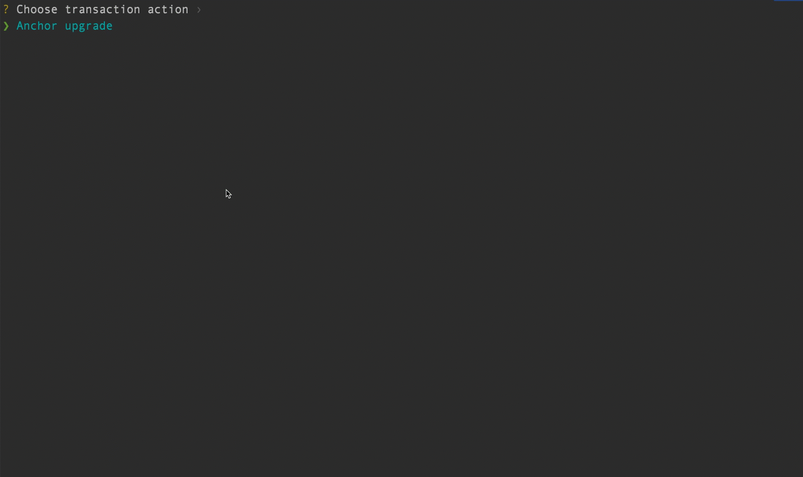
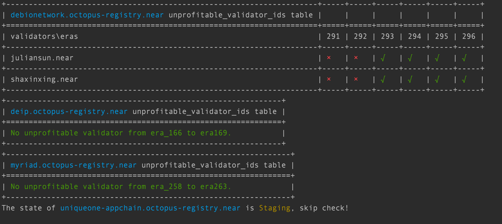

# oct-cli-rs

This project aims to provide an automated tool to deal with daily maintenance tasks of octopus network.

## Usage

You can run oct-cli in command and finish some functions interactively, eg:



After the interactive program is executed, the command line parameters will be printed, and next time you can skip the interaction and use the command line directly.

## Sub-commands

### Deploy or Upgrade

Usage:

```shell
USAGE:
    oct-cli deploy-or-upgrade [SUBCOMMAND]

FLAGS:
    -h, --help    Prints help information

SUBCOMMANDS:
    mainnet    
    testnet 
```

Example:

1. How to upgrade anchor contract from v2.1.0 to v2.2.0 in account: anchorxsb.testnet:

```shell
oct-cli deploy-or-upgrade testnet select-rpc block-pi select-accounts manual-select-accounts --account-ids anchorxsb.testnet upgrade /Users/xushenbao/project/blockchian/octopus/oct-cli-rs/res/appchain_anchor_v2.1.0.wasm migrate_state {}
```

### Clean up states

Usage:

```shell
USAGE:
    oct-cli clean-state [SUBCOMMAND]

FLAGS:
    -h, --help    Prints help information

SUBCOMMANDS:
    mainnet    
    testnet 
```

Example:

1. Clean up `anchorxsb.testnet`:

```shell
oct-cli clean-state testnet select-rpc block-pi select-accounts manual-select-accounts --account-ids anchorxsb.testnet clean-state y
```

### Check

Usage:

```shell
oct-cli-check-reward 

USAGE:
    oct-cli check-reward [SUBCOMMAND]

FLAGS:
    -h, --help    Prints help information

SUBCOMMANDS:
    mainnet    
    testnet 
```

Example:

1. Check unprofitable validator of all appchain in mainnet:

```shell
oct-cli check-reward mainnet select-rpc block-pi input-registry-account octopus-registry.near
```

The result is like:



## Sub-commands design

### deploy

To deploy a wasm file to a specific account, followed by a function call of an init-function.

| Sub-command | Options | Description | Default |
| ---- | ---- | ---- | ---- |
| deploy | --network | Can be `mainnet`, `testnet` | `testnet` |
|  | --rpc-endpoint | Can be `official`, `block-pi` | `official` |
|  | --account | The account to be deployed | N/A |
|  | --wasm | The wasm file to be deployed | N/A |
|  | --init-function | The function to initialize the state of the contract | N/A |
|  | --init-args | The arguments of the init-function, this param should be a json string | N/A |

### upgrade

To upgrade a contract by calling function `store_wasm_of_self` and then `update_self` of it. (This pattern is to ensure the storage migration and the code deployment are executed in one transaction.)

| Sub-command | Options | Description | Default |
| ---- | ---- | ---- | ---- |
| upgrade | --network | Can be `mainnet`, `testnet` | `testnet` |
|  | --rpc-endpoint | Can be `official`, `block-pi` | `official` |
|  | --registry | The account of Octoput Registry contract. | N/A |
|  | --appchain-id | The appchain id of Octoput Anchor contract. If omitted, the cli will call registry contract. | N/A |
|  | --wasm | The wasm file to be deployed | N/A |

### call

To call a specific function of a contract.

| Sub-command | Options | Description | Default |
| ---- | ---- | ---- | ---- |
| call | --network | Can be `mainnet`, `testnet`. | `testnet` |
|  | --rpc-endpoint | Can be `official`, `block-pi`. | `official` |
|  | --registry | The account of Octoput Registry contract. | N/A |
|  | --appchain-id | The appchain id of Octoput Anchor contract. If omitted, the cli will call registry contract. | N/A |
|  | --function | The function name to call. | N/A |
|  | --args | The arguments of the calling function. Should be a json string. | N/A |
|  | --gas | The attached gas to the call. Unit: Tera | 200 |
|  | --deposit | The attached deposit to the call. Unit: yoctoNear | 0 |

### view

To call a specific view function of a contract.

| Sub-command | Options | Description | Default |
| ---- | ---- | ---- | ---- |
| view | --network | Can be `mainnet`, `testnet`. | `testnet` |
|  | --rpc-endpoint | Can be `official`, `block-pi`. | `official` |
|  | --registry | The account of Octoput Registry contract. | N/A |
|  | --appchain-id | The appchain id of Octoput Anchor contract. If omitted, the cli will call registry contract. | N/A |
|  | --function | The function name to call. | N/A |
|  | --args | The arguments of the calling function. Should be a json string. | N/A |

### check-reward

To check the rewards status of an Octopus Appchain Anchor contract by calling a series of view functions.

| Sub-command | Options | Description | Default |
| ---- | ---- | ---- | ---- |
| check-reward | --network | Can be `mainnet`, `testnet`. | `testnet` |
|  | --rpc-endpoint | Can be `official`, `block-pi`. | `official` |
|  | --registry | The account of Octoput Registry contract. | N/A |
|  | --appchain-id | The appchain id of Octoput Anchor contract. | N/A |

### console

Run the cli in `console` mode.

In console mode, the cli can remember the environment (context) of all commands, like `network`, `rpc-endpoint`, `account`, `registry`, `gas` etc. This mode can help to simplify the commands that the users need to input. In console mode, the users can use almost all of the above commands but don't need to specify all options, as some of options become a part of context.

| Sub-command | Options | Description | Default |
| ---- | ---- | ---- | ---- |
| console | --network | Can be `mainnet`, `testnet`. | `testnet` |
|  | --rpc-endpoint | Can be `official`, `block-pi`. | `official` |
|  | --registry | The account of Octoput Registry contract. | N/A |

For example, users can enter console mode by specifying `network`, `rpc-endpoint` and `registry`:

```shell
oct-cli console --network testnet --rpc-endpoint block-pi --registry registry.test_oct.testnet
```

And then run several `call`, `view` or other command in console mode without specifying these options.

Here are the sub-commands that can be used in console mode:

| Sub-command | Options | Description | Default |
| ---- | ---- | ---- | ---- |
| set | --network | Can be `mainnet`, `testnet`. | N/A |
|  | --rpc-endpoint | Can be `official`, `block-pi`. | N/A |
|  | --registry | The account of Octoput Registry contract. | N/A |
|  | --appchain-id | The appchain id of Octoput Anchor contract. | N/A |
|  | --gas | The attached gas to a function call. Unit: Tera | N/A |
| call | --appchain-id | The appchain id of Octoput Anchor contract. If omitted, the cli will call registry contract. | The value in context |
|  | --function | The function name to call. | N/A |
|  | --args | The arguments of the calling function. Should be a json string. | N/A |
|  | --gas | The attached gas to the call. Unit: Tera | The value in context |
|  | --deposit | The attached deposit to the call. Unit: yoctoNear | 0 |
| view | --appchain-id | The appchain id of Octoput Anchor contract. If omitted, the cli will call registry contract. | The value in context |
|  | --function | The function name to call. | N/A |
|  | --args | The arguments of the calling function. Should be a json string. | N/A |
| check-reward | --appchain-id | The appchain id of Octoput Anchor contract. | The value in context |
| upgrade | --appchain-id | The appchain id of Octoput Anchor contract. | The value in context |
|  | --wasm | The wasm file to be deployed | N/A |
| run | --file | A text file that contains a series of the above sub-command(s). | N/A |
